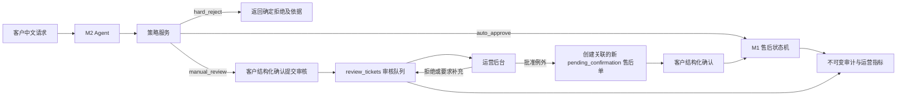

# M3：售后运营闭环与人工审核

## 1. 目标

M3 将 VeriReturn 从“可执行单次售后流程的 Agent”扩展为“可运营、可治理的售后处置系统”。它处理 M1 规则无法自动决定、存在风险或需要例外审批的请求，并保留每一次决策的人员、规则版本、原因和业务结果。

它要解决的业务问题是：客户说“商品已拆封但有质量问题，申请退款”，系统不能让模型自行放宽退款规则，也不能简单丢弃请求。Agent 可以收集请求和展示处理路径；运营人员在受权限、可追踪的后台中作出决定；客户仍须确认所有会产生售后履约的最终方案。

### 非目标

- 不做多 Agent 编排。
- 不让 LLM 决定资格、退款金额、权限、审核结果或状态迁移。
- 不接入真实支付、OMS、WMS 或物流回调；继续通过适配器模拟外部业务系统。
- 不在 M3 第一版加入向量数据库或 RAG。

## 2. 核心原则

1. **业务事实和审核工单分离。** `after_sales_cases` 只记录已进入售后状态机的业务单；无法自动处置的请求先成为 `review_tickets`，不能借审核接口修改历史售后单。
2. **旧状态机不回退。** 现有 `manual_review` 保持 M1 终态。审核通过时，由受信任的领域命令创建一张关联原工单、处于 `pending_confirmation` 的新售后单，客户必须再次结构化确认。
3. **人和模型均不越过策略边界。** 模型只识别意图、补充材料和解释状态；策略服务产出自动通过、确定拒绝或人工审核三种处置结果。
4. **审核是并发安全命令。** 所有写入有幂等键；领取和决策使用行锁及 `version` 乐观锁，避免两位运营人员同时决定同一工单。
5. **审计是事实记录。** 审核决策采用追加事件表；业务状态和审计事件在同一 PostgreSQL 事务内提交，数据库 trigger 拒绝更新或删除审计事件。

## 3. 总体逻辑



### 3.1 自动路径

退款、换货等确定性满足资格的请求继续走 M2 → M1。M3 不改变这条路径，也不改变 M2 的 `interrupt` 确认语义。

### 3.2 人工审核路径

策略服务输出 `disposition=manual_review` 和明确的 `trigger_code`，例如 `QUALITY_DISPUTE_REQUIRES_EVIDENCE`、`HIGH_AMOUNT_EXCEPTION`、`DUPLICATE_AFTER_SALES_RISK`。Agent 展示订单、请求类型、命中的规则和将提交给运营的材料摘要，然后中断等待客户的 `approved` 结构化确认。

确认后才创建审核工单。Agent 不能自行提交，客户重复消息不能创建第二张审核工单。运营人员可以领取、要求补充材料、批准例外或拒绝。批准例外不会直接退款：系统以审核工单为唯一来源创建关联售后单，返回 `pending_confirmation`，客户确认后才进入既有履约流程。

### 3.3 运营决策路径

| 决策 | 工单结果 | 业务副作用 |
|---|---|---|
| `request_more_info` | `waiting_customer` | 无售后单写入；客户补充材料后回到 `open` |
| `reject` | `rejected` | 无售后单写入；记录拒绝码和面向客户解释 |
| `approve_exception` | `approved` | 原子创建一张关联该工单的 `pending_confirmation` 售后单；客户需再次确认 |
| `close_duplicate` | `closed` | 关联既有工单，只保留处置记录 |

审核中原有 `manual_review` 售后单不会恢复或改写。若它是工单来源，保留为终态并通过 `source_case_id`、`superseding_case_id` 建立关联。

## 4. 领域模型与数据库设计

PostgreSQL 继续是唯一业务真相来源。所有时间使用 `timestamptz`，金额使用 `numeric(10,2)`，枚举字段使用 `CHECK` 约束而非仅依赖应用代码。

### 4.1 新表

| 表 | 关键字段 | 用途与约束 |
|---|---|---|
| `actors` | `id`, `display_name`, `role`, `active` | 角色为 `customer`、`operator`、`ops_manager`、`internal_service`；服务端根据已认证身份查角色，客户端不可提交 role。可在现有 `users` 上扩展或迁移为此表。 |
| `policy_versions` | `id`, `version`, `status`, `rules_json`, `checksum`, `published_by`, `published_at` | `draft/published/retired`；同一时刻仅一个 published 版本；发布后配置不可改，只能新建版本。 |
| `review_tickets` | `id UUID`, `requester_id`, `order_id`, `source_case_id`, `source_run_id`, `request_snapshot JSONB`, `trigger_code`, `priority`, `status`, `assigned_operator_id`, `due_at`, `version`, `policy_version_id`, `superseding_case_id` | `source_case_id` 与 `source_run_id` 可为空，但至少绑定订单与请求人；`status` 为 `open/claimed/waiting_customer/approved/rejected/closed/expired`。审批结果与 `superseding_case_id` 一对一。 |
| `review_events` | `id`, `ticket_id`, `sequence_no`, `event_type`, `payload JSONB`, `actor_id`, `actor_role`, `request_id`, `created_at` | 追加式事件流；`UNIQUE(ticket_id, sequence_no)`；PostgreSQL trigger 禁止 `UPDATE/DELETE`。 |
| `review_attachments`（可选） | `id`, `ticket_id`, `storage_key`, `sha256`, `content_type`, `uploaded_by`, `created_at` | M3.1 只保存文本补充材料。若后续接入图片，文件放对象存储，数据库只保存元数据和哈希。 |

### 4.2 对既有表的最小变更

`after_sales_cases` 增加 nullable 的 `policy_version_id`、`source_review_ticket_id` 和 `supersedes_case_id`。`source_review_ticket_id` 唯一，保证一个批准审核不会因重试生成多张替代售后单。

现有 `audit_logs` 继续记录业务状态变化；`review_events` 记录审核流程。二者通过 `case_id`、`ticket_id`、`request_id`、`agent_run_id` 可追踪同一请求。

### 4.3 索引与事务

- `review_tickets(status, priority DESC, due_at, created_at)`：待处理队列。
- `review_tickets(assigned_operator_id, status, updated_at DESC)`：个人工作台。
- `review_tickets(requester_id, created_at DESC)`：客户查询。
- `review_events(ticket_id, sequence_no)`：时间线。
- `after_sales_cases(source_review_ticket_id)`：唯一索引。

领取和决策均使用 `SELECT ... FOR UPDATE`；请求携带 `expected_version`，版本不一致返回 `REVIEW_VERSION_CONFLICT`。命令在一个事务中完成工单状态、版本递增、审核事件、业务售后单和幂等记录。唯一约束处理网络重试及并发抢占。

## 5. 策略服务

将现有二元 `eligible/not eligible` 结果演进为：

```json
{
  "disposition": "auto_approve | hard_reject | manual_review",
  "policy_version": "2026-10-01",
  "policy_code": "QUALITY_DISPUTE_REQUIRES_EVIDENCE",
  "explanation": "已拆封且申报质量问题，需要人工核验材料。",
  "eligible_amount": "199.00",
  "review_priority": "normal"
}
```

确定性规则仍由 Python 领域服务执行，配置来源是已发布的 `policy_versions.rules_json`。规则输入是订单事实、售后类型和结构化原因；规则输出必须可回放。每张自动售后单和审核工单都固定保存命中的 `policy_version_id`、策略码和请求快照，因此后续规则发布不会改写历史结论。

硬拒绝与人工审核必须显式区分。举例：超过时效且没有质量问题为 `hard_reject`；已拆封但声称质量问题为 `manual_review`。这避免运营队列被普通无资格请求淹没，也避免模型根据语气自行升级例外。

## 6. API 与权限边界

### 客户与 Agent API

- `POST /agent/threads/{thread_id}/messages`：新增受限意图 `submit_review_request`，只能构建审核草稿。
- `POST /agent/review-confirmations/{id}`：客户结构化确认或取消审核提交。
- `GET /review-tickets/{id}`：仅工单所属客户可读，返回脱敏时间线和当前状态。
- `POST /review-tickets/{id}/supplements`：仅 `waiting_customer` 状态的所属客户可补充文本材料，必须使用幂等键。

### 运营 API

- `GET /ops/review-tickets?status=open&priority=high`：队列、分页、排序和过滤。
- `POST /ops/review-tickets/{id}/claim`：领取；传 `Idempotency-Key` 与 `expected_version`。
- `POST /ops/review-tickets/{id}/decisions`：作出四种结构化决策；要求 `expected_version`、`reason_code`、面向客户的说明。
- `GET /ops/review-tickets/{id}/timeline`：读取完整审核事件与关联业务审计。
- `GET /ops/metrics/summary`：按时间区间返回指标；不暴露其他客户的订单详情。

认证层从现有开发用 `X-Demo-User-Id` 演进为 `ActorContext(id, role)`。开发阶段可以仍通过 Header 定位 actor，但**角色必须由服务端数据库映射**，不接受 `X-Demo-Role`。生产替换为网关/JWT 适配器，领域服务只消费 `ActorContext`。

客户只能查看自己工单；`operator` 可领取和决策；`ops_manager` 可查看全量队列和策略发布；策略发布与内部回调分属不同权限。LLM、浏览器和普通客户均无运营命令权限。

## 7. Agent 与人工协作

M2 的 LangGraph 图只增加“审核草稿、客户确认、提交工单、查询工单状态、补充材料”节点。领取、批准和拒绝是运营 API 的确定性命令，不经 LLM 路由。

对模型输出继续使用 Pydantic schema。任何模型生成的审核原因只作为材料，不可成为 `trigger_code`、优先级、策略版本或运营决策。工具参数中的 `actor_id`、`policy_version_id`、金额、`expected_version` 全由服务端注入或读取。

Agent 在回答中提供可解释信息：命中的策略码、是否进入人工审核、当前 SLA、下一步由谁完成。它不能承诺“审核一定通过”，也不能编造审核进度。

## 8. 运营指标与可观测性

M3 首版使用 PostgreSQL 聚合查询或物化视图，不引入消息队列和独立分析数据库。每日或部署后通过受控脚本 `REFRESH MATERIALIZED VIEW CONCURRENTLY` 刷新，接口也可在小数据量下直接聚合。

指标至少包括：

- 工单进入量、未领取量、超 SLA 量和优先级分布；
- 首次领取时长、审核完成时长、P50/P95；
- 自动处理率、人工介入率、人工批准率与拒绝原因分布；
- 审核通过后客户确认率、最终完成率；
- 按策略版本和 `trigger_code` 的命中与结果分布；
- Agent 运行失败率、工具调用错误率和人工升级率。

每个请求使用现有 `request_id` 串联 Agent trace、审核事件和 M1 审计。日志采用 JSON 结构化格式，至少记录 request ID、actor ID（展示端脱敏）、ticket ID、case ID、耗时和错误码。

## 9. 技术栈

| 层 | 选择 | 原因 |
|---|---|---|
| Python 运行时 | Miniforge `verireturn`，Python 3.11 | 沿用既有可复现实验环境。 |
| API 与校验 | FastAPI、Pydantic v2、Uvicorn | 复用当前 API 契约、依赖注入和 schema 校验。 |
| 事务与迁移 | PostgreSQL、SQLAlchemy 2、psycopg、Alembic | 支持行锁、JSONB、部分/组合索引、约束、事务与可审计 migration。 |
| Agent | LangGraph、PostgresSaver、OpenAI-compatible DeepSeek adapter | 只负责用户语言交互和可恢复确认，不参与运营决策。 |
| 幂等与一致性 | PostgreSQL 唯一约束、请求指纹、`SELECT FOR UPDATE`、乐观锁版本 | 防重复提交、防并发双决策，且不引入 Redis。 |
| 运营前端 | React + TypeScript + Vite + TanStack Query + Ant Design | 表格、筛选、时间线和表单适合审核台；前后端 API 契约清晰。 |
| 测试 | pytest、httpx、PostgreSQL 集成测试；前端可加 Playwright | 重点验证事务、权限和页面主流程。 |
| 指标 | PostgreSQL view/materialized view + FastAPI 指标接口 | 数据量小且指标强关联事务数据，避免过早引入数仓。 |

## 10. 向量数据库决策

M3 第一版**不使用向量数据库**。原因是本阶段的核心输入是订单、售后单、策略版本、审核状态和权限，它们都是强结构化数据；退款资格和审核路由必须由确定性规则与人工决策决定。向量检索会增加索引构建、切分、召回评测、版本一致性和错误引用成本，却不能解决 M3 的主问题。

若后续积累了大量审核 SOP、商品类目规则、客服制度和案例说明，可在 M3.1 引入 PostgreSQL 的 `pgvector`，而不是额外部署 Milvus、Chroma 等服务：

1. 文档以 `knowledge_documents`、`knowledge_chunks` 保存原文、版本、权限范围、source URL 和 SHA-256；embedding 只是派生数据。
2. 采用 PostgreSQL 全文检索 + `pgvector` 的混合召回；结果必须返回文档片段、版本和引用。
3. RAG 只能帮助 Agent 给出解释和帮助运营检索 SOP，不能直接改变 `disposition`、金额、权限、状态或审核决定。
4. 上线前以标注问题集验证 Recall@k、引用正确率、过期文档隔离率和“无引用不作答”率。

只有满足“至少数十份稳定、经审核的内部文档，且运营检索耗时已成为明显痛点”这一条件，才值得执行该扩展。

## 11. 实现顺序

### M3.1：可信审核事务

1. 定义 `ActorContext` 与角色映射，补全运营权限依赖。
2. 新增 `policy_versions`、`review_tickets`、`review_events` 与关联字段 migration；为审核事件加 append-only trigger。
3. 实现策略三分流、客户审核提交确认、工单创建、领取、补充材料和审核决策领域命令。
4. 审批通过时原子创建关联的 `pending_confirmation` 替代售后单；不修改原 `manual_review` 终态。

### M3.2：运营工作台与指标

1. 实现运营队列、详情时间线、领取和决策 API。
2. 用 React/TypeScript 实现列表、筛选、SLA、详情和决策表单。
3. 实现聚合指标 API 与物化视图刷新脚本。

### M3.3：评测与交付

1. 扩展真实 Agent 评测，覆盖审核提交、补充材料、状态查询与越权。
2. 对审核命令运行 PostgreSQL 并发、幂等、审计不可变和策略回放测试。
3. 保留 M1/M2 的 30 条 DeepSeek 评测作为回归门禁。
4. 补充演示数据、架构图、API 文档、设计记录和一段端到端录屏。

## 12. 验收标准

M3 通过需要同时满足：

1. 客户或模型无法自行创建审核工单、批准例外、伪造角色或读取他人工单。
2. 两个运营人员并发领取或决策时，只能有一个成功；同一幂等键重试只产生一次事件和至多一张替代售后单。
3. 审核批准不会修改或重开原 `manual_review` 售后单；新单必须关联审核工单且仍要求客户确认。
4. 每张售后单和审核工单能回放到固定策略版本、输入快照、审核事件和最终业务审计。
5. 审核事件、业务审计均被 PostgreSQL 拒绝更新和删除。
6. 指标能从固定测试夹具精确计算自动化率、人工介入率、SLA、批准率和 P95 处理时长。
7. M1/M2 全量回归、Alembic drift 检查，以及新增 M3 PostgreSQL 集成测试均通过。
8. 新增 M3 端到端 case 覆盖正常审核、拒绝、补料、越权、过期、重复提交、并发决策和审核后客户确认；所有确定性 case 必须 100% 通过。
