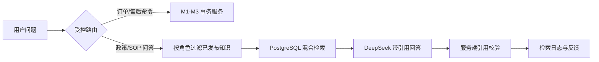

# M4：证据驱动的售后知识 Agent

M4 解决售后系统中的知识型请求：客户需要了解退款、换货与取件流程；运营人员需要检索内部审核 SOP。它不改变 M1–M3 的事务边界。订单资格、金额、权限、状态迁移和审核决定仍只由确定性领域服务和授权人员处理。



## 数据与不变量

- `knowledge_documents` 是稳定文档身份，带 `customer`、`operator` 或 `shared` 受众范围。
- `knowledge_document_versions` 保存 Markdown 正文、SHA-256、embedding 模型、发布人与时间。每份文档由部分唯一索引保证至多一个 `published` 版本。
- PostgreSQL trigger 禁止删除已发布/退役版本；已发布版本只能转为 `retired`，正文、校验和、模型和发布事实不能改写。
- `knowledge_chunks` 保存分块正文、jieba 分词后的 `search_text`、chunk hash 与 `vector(512)`；`(document_version_id, ordinal)` 唯一，保证任务重试不产生重复 chunk。
- `knowledge_ingestion_jobs` 以 `FOR UPDATE SKIP LOCKED` 和租约领取。worker 崩溃后，过期 `running` 任务能再次领取。
- `knowledge_retrieval_logs` 只保存查询摘要，不保存原始问题；记录服务端计算的可见受众、候选 chunk、最终引用、Agent run 和耗时。

知识文档是解释证据，不是策略输入。M3 的 `policy_versions` 和 M4 知识版本独立演进，历史业务结论不受知识发布影响。

## 检索

中文问题先经 `jieba` 分词；PostgreSQL 的 `simple` 全文词典在分词文本上建 GIN 表达式索引。向量由本地固定的 `BAAI/bge-small-zh-v1.5` 生成，维度为 512，使用 pgvector HNSW 与余弦距离。两组候选以 Reciprocal Rank Fusion 合并，避免把全文 rank 与余弦距离直接相加。

所有检索在 SQL 查询阶段先限制：文档必须已发布，且受众属于当前 actor 的服务端角色范围。客户只可见 `customer/shared`；运营人员可见三类文档。模型无法通过提示词扩大该集合。

## Agent 安全

LangGraph 新增 `knowledge_qa → retrieve_knowledge → grounded_answer` 分支。携带订单号的资格、退款、换货和审核请求继续优先走 M1–M3。DeepSeek 仅接收固定证据块，证据被声明为不可信数据；模型返回 Pydantic JSON，引用 ID 必须属于本次候选集。服务端再次校验后才写入引用日志并返回答案。

若模型不可用，系统采用抽取式带引用回答，不会用无证据的生成文本替代。若没有可见 chunk，则明确提示没有可引用的已发布规则。

## API 与运营台

- `POST /knowledge/search`：任意已认证 actor 的受限检索入口；后端由 `actors` 表计算受众范围。
- `POST /knowledge/retrievals/{id}/feedback`：仅原检索 actor 可提交一次 `helpful/unhelpful` 反馈。
- `GET /ops/knowledge/documents`：运营查看文档和版本状态。
- `POST /ops/knowledge/documents`、`POST /documents/{id}/versions`、`POST /versions/{id}/ingestion`、`POST /versions/{id}/publish`：仅 `ops_manager` 可写，全部要求幂等键。

React 运营台新增 M4 知识表格、运营身份切换、草稿创建、索引入队与 ready 版本发布入口。Worker 是独立进程，不暴露成浏览器可调用的执行 API。

## 本地模型与运维

`scripts/bootstrap_embedding_model.sh` 下载 FastEmbed 官方预构建 ONNX 文件到 `.local/models/fastembed`，该路径被 Git 忽略。运行时用 `local_files_only=True`，避免服务实例隐式下载或切换模型。

```sh
DATABASE_URL=postgresql+psycopg://verireturn@127.0.0.1:54329/verireturn \
  mamba run -n verireturn python -m scripts.seed_m4_knowledge
DATABASE_URL=postgresql+psycopg://verireturn@127.0.0.1:54329/verireturn \
  mamba run -n verireturn python -m scripts.run_knowledge_worker
DATABASE_URL=postgresql+psycopg://verireturn@127.0.0.1:54329/verireturn \
  mamba run -n verireturn python -m scripts.publish_m4_demo_knowledge
```

演示语料是项目原创模拟政策和 SOP，明确不代表任一真实电商平台规则。

## 验收

M4 的门禁包括：

1. 文档版本、索引任务、发布切换与幂等在 PostgreSQL 中可回放；已发布正文无法篡改。
2. 客户不能读取运营文档；任何引用都必须属于本次服务端过滤后的候选集。
3. 知识问题不能创建售后单、确认、审核工单或其他 M1/M3 写操作。
4. 真实本地 512 维 embedding、PostgreSQL GIN/HNSW 和真实 DeepSeek 必须至少完成一次端到端验证。
5. M1–M3 全量回归、Alembic drift 检查、前端构建和 M4 独立评测均通过。
