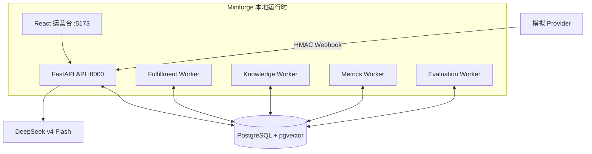

# M7 演示架构

M7 没有新的业务数据通道。`demo_m7.py` 作为外部客户、运营人员和 Provider 调用 API；它不会导入领域服务去改写状态。`verify_m7_demo.py` 可以导入模型类查询 PostgreSQL，但只读检查以下不变量：确认在先、工具调用白名单、Outbox 投递、履约序列、审核事件顺序、指标/告警状态和 Trace 关联。

本地启动器从 `.env` 导出密钥到 API 和 Worker 进程。`.env` 被 Git 忽略，当前权限为仅属主可读写；M7 输出写入同样被忽略的 `.local/m7/`。DeepSeek 不参与金额、资格、权限、审核或履约状态判断。
