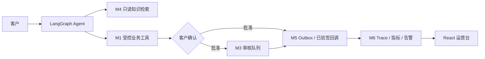

# M7 设计：可演示、可复核、可投递

M7 不改变 M1–M6 的业务边界。它把已有的事务 Agent、人工审核、知识检索、异步履约和可观测性组织成可重复运行的作品集演示，并将结论固定为 PostgreSQL 中可复核的事实。

## 目标与边界

- 用非 Docker 的 Miniforge + PostgreSQL 环境完成一键本地演示。
- 演示知识问答、退款确认、取件履约、人工审核、告警闭环和 Trace 下钻。
- 所有业务推进经过既有 HTTP 接口；M7 脚本不会直接改写售后、审核或履约状态。
- `verify_m7_demo.py` 只读取数据库事实，不能通过控制台输出判定成功。
- 演示 fixture 使用 `U7001`、`O7001`、`O7003` 和 `M7-DEMO` 文本标识；不会清空或重置既有数据。

## 技术栈

| 层 | 实现 |
|---|---|
| 运行 | Miniforge/Mamba `verireturn` 环境、Shell、Python 3.11 |
| Agent | LangGraph checkpoint、DeepSeek OpenAI-compatible 意图解析；可切换既有 keyword fallback |
| 业务与持久化 | FastAPI、SQLAlchemy、Alembic、PostgreSQL、pgvector |
| 异步 | PostgreSQL lease、Outbox/Inbox、四个 Worker daemon |
| 运营台 | React、TypeScript、Vite、Ant Design |
| 验收 | pytest、PostgreSQL 集成测试、M7 HTTP 演示和数据库断言 |

## 可复现性设计

`seed_m7_scenario.py` 仅补齐不存在的 fixture。`demo_m7.py` 以 `M7_RUN_KEY` 生成稳定的会话、消息、幂等键和 Provider event ID；同一 key 的完成结果会从 `.local/m7/demo-<key>.json` 复用。若某次运行中断，应使用一个新 key 创建新的、可追溯的演示批次，禁止篡改旧业务事实。

`M7_AGENT_MODE=live`（默认）使用 `.env` 中的 DeepSeek 配置。`M7_AGENT_MODE=deterministic` 仅在本地验收或网络不可用时关闭模型配置，使用相同 LangGraph 和工具图上的 keyword fallback。两种模式都会把实际模型名写入 `agent_runs`；演示报告不把 fallback 伪称为真实模型调用。
