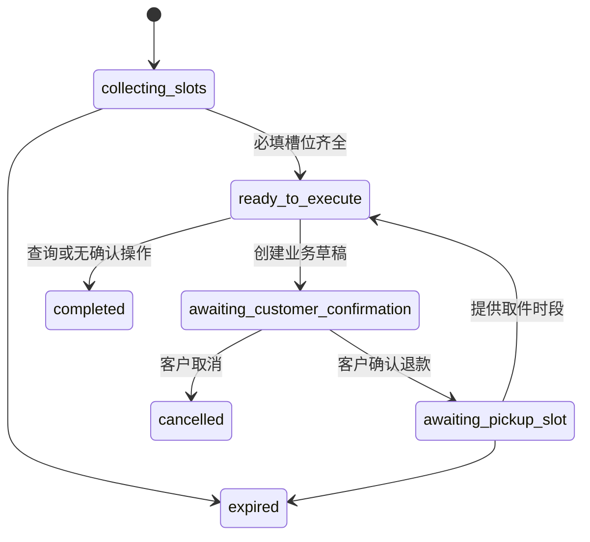

# M8：可信会话记忆与任务恢复

## 目标

M8 让售后 Agent 能可靠处理跨轮补充、错误订单号修正、确认后的取件预约和页面刷新恢复。它不把聊天文本或模型摘要当作业务真相：订单、金额、权限、售后状态和履约事实仍只来自受控业务 API。

## 分层

| 层 | 实现 | 能否驱动写操作 |
|---|---|---|
| 业务事实 | M1–M7 PostgreSQL 领域表和受控工具 | 可以，领域服务决定 |
| 当前任务 | `agent_tasks` 的槽位、阶段和版本 | 可以，只作为图的受限输入 |
| 会话记录 | `agent_message_records` | 不可以，只用于恢复页面和模型短上下文 |
| 任务事件 | `agent_task_events` 追加事件 | 不可以，用于审计与排错 |
| 政策知识 | 已发布知识库/pgvector | 不可以，只能解释政策 |

不使用向量数据库保存用户记忆。订单号、售后单号、取件时段和确认状态需要精确查询、权限隔离与版本控制，结构化 PostgreSQL 记录比语义召回更可靠。

## 状态机

每个线程最多有一个当前任务。新写请求不会静默覆盖待确认任务；客户必须先确认或取消。修改订单号、售后类型或原因后，旧资格判断不复用，必须重新调用业务服务。

## 正确性与安全

- `agent_threads` 服务端绑定 `actor_id`，其他客户无法读取或污染已知 thread ID。
- `(thread_id, client_message_id)` 唯一，网络重试返回同一已保存回复。
- `agent_task_events` 在 PostgreSQL 上由 trigger 保护为 append-only。
- LangGraph 使用 `run_id` 作为每一轮独立 checkpoint namespace；它只恢复 `interrupt()` 的确认操作，旧 checkpoint 槽位不会串入新消息。
- 模型输出仅为受 Pydantic 约束的意图与候选槽位；`TaskMemory` 合并槽位，领域 API 校验订单和权限。
- 对于需调用模型的模糊表达，`TaskMemory.intent_context()` 只传递当前任务槽位和最近 6 条、每条最多 320 字的同客户会话记录。明确动作先走本地快速路由，不发送历史记录；上下文只能消解指代，不能成为业务事实或写操作依据。

## 验收案例

1. “帮我退款，未拆封” → 记录退款任务并索要订单号。
2. `O10001` → 业务系统返回订单不存在，任务仍保留并继续索要订单号。
3. `O1001` → 恢复退款流程，创建待确认售后单，不退化为订单查询。
4. 确认后“明天上午取件” → 使用任务保存的售后单完成预约。
5. 刷新 `/agent` → 从线程快照恢复对话和当前任务卡片。
6. 另一客户读取同一 thread ID → 返回不存在，不泄漏对话或槽位。

## M8 补齐：分页、放弃与崩溃恢复

- `GET /agent/threads/{thread_id}` 使用 `before_sequence` 游标向前分页；默认 30 条、最大 100 条，并返回 `next_before_sequence`。当前任务始终随每一页返回。
- `POST /agent/threads/{thread_id}/task/cancel` 可放弃补槽或取件任务。待确认申请复用确认拒绝命令，取消业务草稿；已确认后的取件任务只停止 Agent 后续安排，不撤销售后申请。
- 业务确认成功后，确认记录会成为持久化事实。Runtime 启动时扫描“确认已批准、任务仍等待确认”的不一致投影，并将其修复为 `schedule_pickup / awaiting_pickup_slot`。恢复过程记录 `task_projection_recovered` 事件。
