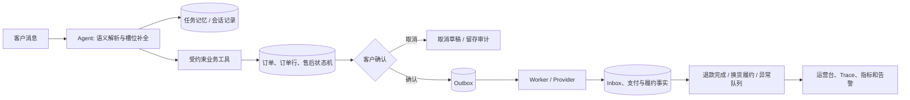

# VeriReturn 项目实现总览

本文说明系统如何从客户一句售后请求，走到可恢复、可审计的业务结果，以及本地如何复现演示。

## 1. 业务流程



1. Agent 只抽取意图和用户已给出的槽位。模型无法决定金额、权限、售后资格、库存、支付或审核结论。
2. 任务记忆保存焦点任务、缺失槽位和有限脱敏上下文。多任务并存时要求选择订单或任务，避免一句话误操作多个售后单。
3. 业务 API 在事务内校验订单归属、订单行、可售后数量、金额和状态机，并以幂等键处理客户重试。
4. 创建售后单只生成待确认草稿。确认前不会投递履约、库存或支付命令。
5. 确认后，取件、支付退款和换货动作以 Outbox 持久化；Worker 用租约、`FOR UPDATE SKIP LOCKED`、重试和去重消费。
6. Provider 回调先验签，再写入 Inbox/领域事实。退款必须同时匹配退款意图的金额、币种、外部引用和事件 ID。
7. 运营人员在工作台处理审核、支付对账差异、履约乱序和库存异常；每个操作带版本检查和审计记录。

## 2. 领域边界

| 领域 | 可信事实来源 | Agent 可以做什么 |
| --- | --- | --- |
| 退款资格与金额 | 订单、订单行、领域规则 | 解释结果、发起待确认申请 |
| 库存与换货 | 库存行、预占、履约事件 | 询问商品/规格、展示可信状态 |
| 支付退款 | 已验签渠道回调、对账 | 展示“已提交/渠道成功/异常”，不承诺到账 |
| 人工审核 | 审核工单、运营决策 | 收集材料、展示审核状态 |
| 知识问答 | 已发布知识版本与引用 | 回答政策，不修改业务事实 |

## 3. 可靠性与安全机制

- **一致性**：幂等键、请求指纹、行锁、乐观锁、数据库唯一约束。
- **异步恢复**：Outbox/Inbox、命令状态、租约过期扫描、支付/库存/任务记忆的重启恢复。
- **订单行与库存**：部分退款在退款渠道成功后才累计已退款数量；库存预占会在取消、失败或过期后释放。
- **预约**：取件时段解析为 `Asia/Shanghai` 的 UTC 窗口，限制未来七天、容量和过期时间。
- **隐私**：模型上下文脱敏手机号、邮箱和身份证号；对话保留期可清理，账务和审计事实保持不可变。
- **身份与抗滥用**：开发身份适配器、生产 JWT/OIDC JWKS、服务端 RBAC、Redis 滑动窗口限流。
- **审核材料**：受控上传记录所有者、哈希、MIME 和大小；绑定审核单时再次校验，不接受手填对象引用。

## 4. 本地运行

项目不依赖 Docker；Python、PostgreSQL 均在 Miniforge `verireturn` 环境内运行。

```sh
mamba env update -f environment.yml
M7_AGENT_MODE=live sh scripts/start_m7_local.sh
```

访问：

- Agent 展示页：`http://127.0.0.1:5173/agent`
- 运营工作台：`http://127.0.0.1:5173`
- OpenAPI：`http://127.0.0.1:8000/docs`

停止本地服务：

```sh
sh scripts/stop_m7_local.sh
```

环境变量模板见 [`.env.example`](../.env.example)。真实模型密钥、支付密钥和数据库凭据仅通过本地环境或密钥服务注入，不能提交。

## 5. 验证命令

```sh
mamba run -n verireturn pytest -q
DATABASE_URL='postgresql+psycopg://verireturn@127.0.0.1:54329/verireturn' \
  mamba run -n verireturn alembic upgrade head
DATABASE_URL='postgresql+psycopg://verireturn@127.0.0.1:54329/verireturn' \
  mamba run -n verireturn alembic check
cd frontend && npm run build
```

M10 的支付、附件、预约、库存、认证、隐私和运维边界见 [M10 生产化说明](m10-production.md)。历程设计、验收证据和演示手册保留在 `docs/` 目录中。
